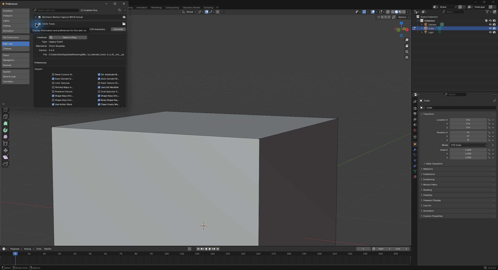

# CC5 Blender pipeline validation

Status: **PASS — CC5 GoB launched Blender 4.5.14 LTS, with CC/iC Tools 2.4.0 enabled.** Verified 2026-09-23. No character round-trip test has been performed.

- CC5 Blender Pipeline: 2.4.0.
- Verified executable: `C:\Program Files\Blender Foundation\Blender 4.5\blender.exe`.
- Executable reports: Blender 4.5.14 LTS; build hash 62c1db4208e8.
- Previous GoB configuration value: `C:\Program Files\Blender Foundation\Blender 5.0\blender-launcher.exe`.
- Configuration file: `C:\Users\Public\Documents\Reallusion\Reallusion Custom\ccic_blender_pipeline_plugin.txt`.
- Exact original configuration preserved in `gob-config.before.json`.
- Baseline hashes and metadata preserved in `launch-baseline.json`.

Only `blender_path` changed. The saved setting was re-read after the live launch and still points to the verified Blender 4.5 executable. All other configuration values match the original backup.

## Live launch evidence

1. Started the installed CC5 application, which opened its empty `Default.ccProject` scene. The repository's character project was not opened.
2. Invoked **Plugins > Blender Pipeline > Go-B** through CC5's own menu.
3. Windows process inspection recorded `CharacterCreator.exe` PID **40660** as the parent of `blender.exe` PID **51348**. Blender's executable path was exactly `C:\Program Files\Blender Foundation\Blender 4.5\blender.exe`.
4. The child command line used `-P C:\Users\Sez\Documents\Reallusion\DataLink\Untitled\go_b.py`, the script generated by CC5's GoB command. The Blender title bar displayed **Blender 4.5.14 LTS**.
5. In that same launched Blender process, opened **Edit > Preferences > Add-ons** and expanded **CC/iC Tools**. Its checkbox was already enabled, its displayed version was **2.4.0**, and its module path ended in `cc_blender_tools-2_4_0\__init__.py`. No add-on enabling, installation, or version change was required.
6. Windows displayed a CC5 firewall permission prompt during launch. The user handled and dismissed it before the UI inspection continued; the agent did not operate the security dialog.

Machine-readable evidence: `launch-processes.json` and `launch-validation.json`. The screenshot records the inspected session, rather than a separate Blender process launched for testing.

## Authoritative installation for the subsequent round trip

- Blender executable: **`C:\Program Files\Blender Foundation\Blender 4.5\blender.exe`**.
- Blender version: **4.5.14 LTS**, build **62c1db4208e8**.
- CC5 Blender Pipeline: **2.4.0**.
- Blender CC/iC Tools: **2.4.0**, enabled.

Use this explicit executable for subsequent character-pipeline scripts and validation. Blender 5.0 remains installed for unrelated work; it was not changed.

## Scope and limitations

This validates the saved GoB target, the actual CC5-to-Blender launch, and add-on availability in the launched process. It does **not** validate character import/export, DataLink character transfer, mesh topology, morphs, skeletons, materials, or a return to CC5.

GoB generated its launch-test files under `C:\Users\Sez\Documents\Reallusion\DataLink\Untitled`, including `go_b.py` and `Untitled.blend`. These are test outputs from the empty CC5 scene. The repository's `CC5\character1.ccProject` was not opened or saved, and its SHA-256 still matches the recorded baseline. No Unity production assets were modified. CC5 and the launched Blender session were left open.
