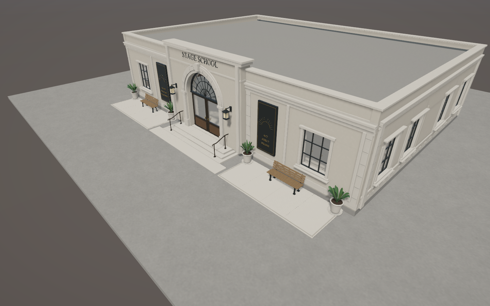

# Stage School frontage revision

Removed the disconnected 23 x 2.1 m pedestrian strip from the authoritative A4 generator, regenerated the master, and rebuilt all three B2 runtime LODs. The entrance steps, small entrance landing and two compact applicant waiting pockets remain, terminating directly into the lot. The landing now uses the same stone paving, terrazzo border and fine expansion joints as the waiting pockets, following the user’s material correction.

## Future path attachment

`Anchors/path.connection.main` is a passive transform in the runtime prefab, registered with `StageSchoolInfrastructure`. Position: building-local Unity **(0, 0.05, -11.55) m**. Forward: **-Z**, outward from the centered entrance landing edge. Its world position/orientation follows the placed building. This defines a future player-built spline-path attachment point only; no path generation, routing, snapping, network or path-width rule has been added. The same convention is documented in A4 `authoring_readiness.json`.

The existing entrance approach and exit markers are now at `(0, 0, -12.8)`, beyond the landing on the lot. The six applicant waiting positions remain unchanged.

## Collision and placement

Replaced the broad forecourt collision slab with three proxies matching the central landing and two waiting pockets. Runtime has 40 box colliders, no mesh colliders, four doors and 25 anchors. Placement reservation is a four-rectangle union: body maintenance margin, central entrance access clearance and two compact pocket margins. It no longer reserves the removed pedestrian strip. The enclosing construction bounds also shrink to match.

## Preservation

Compared with the original immutable `master_freeze.json`, only seven protected files change: A4 generator, authoring metadata, generation report, source blend, exported packet, prefab, and `Exterior_Forecourt.asset`. Every other protected mesh, plant, bench, material, shared library, asset meta/GUID and the Studio scene retains its original hash. See `frontage_authorized_changes.json`. The user-requested revision has a separate `frontage_finish_freeze.json`; the original baseline is retained.

The source geometry checks pass. Current triangle counts: master 586,206; runtime LOD0 466,700; LOD1 151,934; LOD2 111,322. This removal reduces geometry at every level.

## Validation

All 25 focused Edit Mode tests pass, including connection position/direction, no physical collider extending into the removed strip, released placement space and preserved applicant positions. Current frontage and completed-building Unity captures were visually inspected under PC_RPAsset (Unity 6000.6.3f1). Plants and benches were preserved exactly.

Play Mode construction, all five room/entrance routes and opposing-agent traversal passed on the retry with Editor background execution enabled. The broader test still failed sustained hover/click/pinned-reveal checks, so the full integration suite is not certified as passing. The first run passed construction and entrance/audition traversal but hit interview/opposing-agent and pointer-input timeouts; its evidence is retained in `frontage_first_live.txt`. The retry enables Editor background execution during the test and logs route frame counts/positions; this is test infrastructure only. These traversal checks preceded the final paving-material/border-only correction; physical geometry and anchors did not change in that correction.

The existing completion performance caveat remains: this is an Editor functional check, not target-player performance certification. No commit or push.
