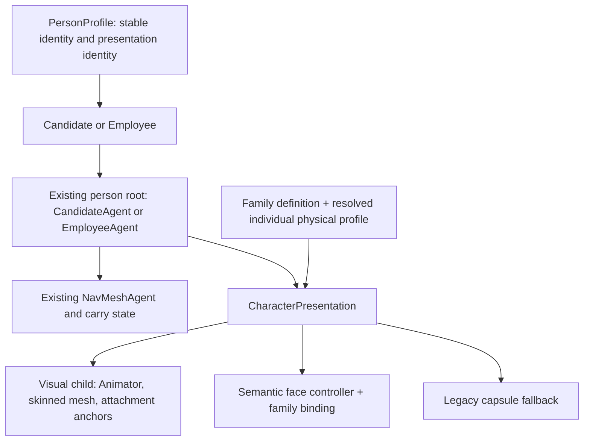

# Character Runtime V1A-1 architecture audit

3 October 2026. Audited on `master`, after Girl checkpoint **`ba63ced6889d4851fadca8f923c8b7239a3925a7`**. **Architecture ready for a separately authorized V1A-2 foundation implementation.** This is an audit and implementation plan, not implementation or Studio adoption. No production scripts, scenes, prefabs, settings or generated character assets were changed during Phase B.

The smallest viable boundary is an explicit presentation identity on the existing `PersonProfile`, resolved by a presentation component on the existing person root. Keep `EmployeeAgent`/`CandidateAgent`, navigation and carry ownership intact. Refactor the universal physical-profile initialization and the few capsule-specific visual consumers. Do not introduce family-specific simulation classes.

Evidence is current first-party code, serialized Studio/navigation settings, committed family reports and the fresh Girl checkpoint tests. Actual version: Unity **6000.6.3f1**, URP **17.6.0**, AI Navigation **2.0.14**, Test Framework **1.8.0**. Older observations in `Docs/AI/UnityProjectContext.md` are historical. No new production visual inspection, Player build, performance benchmark or save/load certification is claimed.

## 1. Girl checkpoint and validation

Starting branch was `master`; starting HEAD and freshly fetched `origin/master` were `e384eed6ca851a65e5932f0e5ed2d11619073d6c`. The 24 pending Girl files were individually reviewed. The complete staged patch was saved and every indexed blob matched the reviewed file, allowing only Git line-ending normalization. No licensed geometry or evidence was staged.

Review repaired UTF-8 mojibake in the two pending reports, restoring the previously committed `CharacterBaseAudit.md` prefix exactly, and removed one trailing blank line from a new test. These were documentation/whitespace corrections, not deformation or runtime changes.

| Fresh checkpoint fixture | Passed | Failed / skipped | Test duration |
| --- | ---: | --- | ---: |
| `GirlCanonicalFoundationTests` | 2 | 0 / 0 | 6.809 s |
| `GirlBlinkPrototypeTests` | 4 | 0 / 0 | 12.394 s |
| `GirlBlinkPersonPrototypeTests` | 4 | 0 / 0 | 5.962 s |

Ten distinct tests passed. Unity compilation succeeded, and readback showed Edit Mode with one clean `Assets/Scenes/Studio.unity`; the post-test Console contained zero errors and zero warnings. A redundant later relay query expired with “no fresh discovery files”; it does not replace the earlier successful compilation/test evidence. The only subsequent C# edit removed the EOF blank line; Phase B changes documentation only.

All **85 purchased files** retained SHA-256, size and mtime. All **4,535 previous family/asset/evidence files**, **318 pre-continuation Girl files** and **627 pre-checkpoint Girl evidence files** retained hashes. Four evidence files changed during reruns; fresh versions were archived, then their historical originals restored byte-for-byte. The 636 Girl generated asset/evidence files checked are ignored and remain local.

Commit **`ba63ced6889d4851fadca8f923c8b7239a3925a7`**, message **`Add Girl canonical character reference`**, was pushed normally to `origin/master`. Local/remote equality and a clean non-ignored tree were confirmed before this audit. No force-push, branch switch, extra worktree, reset or stash occurred.

Local checkpoint receipts: `TestResults/GirlReferenceCheckpoint/{baseline.json,precommit-validation.json,staged-review.json,staged-review.patch,checkpoint.json,bald-tests.xml,blink-tests.xml,person-tests.xml,editor-after-rpc.json,console-after-rpc.json}`; `PriorGirlFoundation/` and `RerunOutputs/` preserve comparison evidence. These are ignored, not checkout prerequisites.

## 2. Exact Girl files committed and classification

All 24 are category **A: reviewable source, tooling, tests, metadata, configuration or documentation**:

```text
.gitignore
Assets/Editor/Characters/GirlBlinkPrototypeTools.cs
Assets/Editor/Characters/GirlBlinkPrototypeTools.cs.meta
Assets/Editor/Characters/GirlFoundationPrototypeTools.cs
Assets/Editor/Characters/GirlFoundationPrototypeTools.cs.meta
Assets/Tests/Editor/GirlBlinkPersonPrototypeTests.cs
Assets/Tests/Editor/GirlBlinkPersonPrototypeTests.cs.meta
Assets/Tests/Editor/GirlBlinkPrototypeTests.cs
Assets/Tests/Editor/GirlBlinkPrototypeTests.cs.meta
Assets/Tests/Editor/GirlCanonicalFoundationTests.cs
Assets/Tests/Editor/GirlCanonicalFoundationTests.cs.meta
Docs/CharacterBaseAudit.md
Docs/CharacterBaseAuditTools/bake_girl_blink.py
Docs/CharacterBaseAuditTools/calibrate_girl_blink.py
Docs/CharacterBaseAuditTools/export_girl_bald.py
Docs/CharacterBaseAuditTools/girl_blink_candidates.json
Docs/CharacterBaseAuditTools/girl_topology_correspondence.py
Docs/CharacterBaseAuditTools/inspect_girl_blink_contact.py
Docs/CharacterBaseAuditTools/package_girl_review.py
Docs/CharacterBaseAuditTools/prepare_girl_blink_unity.py
Docs/CharacterBaseAuditTools/prepare_girl_native_subset.py
Docs/CharacterBaseAuditTools/render_girl_blink.py
Docs/CharacterBaseAuditTools/sample_girl_blink_trajectory.py
Docs/GirlCanonicalReferenceValidation.md
```

Category **B**: generated licensed meshes/prefabs and metadata under `Assets/SilverScreen/Art/Characters/GirlFoundationPrototype/`, ignored. Category **C**: TestResults, renders, videos, XML, NPZ and checkpoint evidence, ignored. Category **D**: all purchased sources remain external under `C:/Users/Sez/Documents/Assets/rigged-stylized-human-body-base-mesh-rigged-3d-models/`, immutable. Category **E**: temporary Blender derivatives, relay commands and diagnostic scripts remain under ignored TestResults. None of B–E was committed.

## 3. Current person and employee architecture

There is no separate domain class named `Person`: **`PersonProfile` is the identity owner**. It holds immutable ID, birth date, talent, wellbeing, career, traits, appearance-profile ID and voice-profile ID, with mutable name/professional role. `Employee.Person` references the same object and adds employment, profession skills/experience, salary, morale, state and intent. `Candidate.Person` also references that object; its immutable `JobSought` records original intent. [PersonProfile:36][person], [Employee:8][employee], [Candidate:6][candidate].

`WorkforceRoster.Population` is the session-wide `PersonPopulation`; duplicate IDs with different profile instances are rejected. Dismissed employees move to `FormerEmployees`, and population identity survives the spawned view. `StudioEmployeeManager` maps employee ID to `EmployeeAgent`. The agent is a Unity simulation/presentation adapter: navigation, task destinations/callbacks, availability, autonomy position, selection indicator and transient held state. It currently also contains primitive filming gestures, a localized boundary violation. [Population:6][population], [Roster:7][roster], [Manager:23][manager], [Agent:120][agent].

## 4. Presentation creation paths

**Current player session:** `Studio.unity` serializes `_startNewStudio: 1` (line 6987). `StudioBootstrap.InitializeEmployees` disables its five authored developer employees; it does not spawn canonical meshes. `RecruitmentDriver.Start` creates/configures the coordinator and `CandidateWorldRouter`, sharing the workforce population. Category intakes in `RecruitmentIntakes.cs` dispatch starter and later arrivals through the same generator and world route. Studio Services supplies six starters, then normal cadence; Talent supplies four starters. Legacy opening-wave and non-facility arrival paths still converge on the router. [Bootstrap:104][bootstrap], [Recruitment:148][recruitment-start], [Intakes:61][intakes], [Definitions:25][recruitment-definitions].

**Orange capsule:** `CandidateWorldRouter.Spawn`, `RecruitmentPresentation.cs:136`, creates `PrimitiveType.Capsule`, installs the narrowed `BodyMesh`, root collider/NavMeshAgent and selection ring, then adds/binds `CandidateAgent`. Orange is `(0.82, 0.55, 0.25)`; ScriptOffice applicants are blue `(0.48, 0.62, 0.82)`. This destination tint is legacy presentation, not a family selector. [Spawn:136][spawn].

**Developer employees:** five roots already serialized in Studio have Transform, MeshFilter, CapsuleCollider, MeshRenderer, NavMeshAgent and EmployeeAgent on the same GameObject. `StudioBootstrap` constructs/registers their domain employees only when the populated scenario is enabled. `Stage1LiveIntegrationBuilder.PromoteAndBake` also reapplies the legacy mesh/profile to discovered employees; it is an explicit Editor command, not ordinary spawning. [Studio:6956][studio], [Promotion:138][promotion].

**Canonical references:** opt-in Editor tooling builds ignored isolated prefabs. No production path calls `HumanBasePrototypeTools.Spawn` or uses the four reference prefabs today. Their tests demonstrate compatibility, not production adoption.

## 5. Capsule ownership

The normal capsule is the person root itself, initially with `CandidateAgent` and later with `EmployeeAgent`. It is not ordinarily a child visual. `CandidateWorldRouter` owns spawning/releasing applicants; `StudioEmployeeManager` owns the employee lookup and departure destruction. `EmployeeNavigationProfile` supplies the shared procedural mesh and dimensions, not domain identity.

Two temporary child representations complicate this: talent waiting idle creates `WaitingBody` and disables the root renderer; held fallback creates reusable `HeldPersonVisual` and disables the root renderer. Both copy the root mesh/materials. Canonical prototypes instead have a separate `CharacterVisualRoot`, with the real Animator/skinned renderer beneath it. [Recruitment:39][waiting], [Held:114][held-placeholder], [Prototype:80][prototype-build].

## 6. Navigation and collider initialization

`EmployeeNavigationProfile` defines body diameter **0.60 m**, navigation/collider radius **0.35 m**, height **2 m**. `BodyMesh` narrows a Unity capsule in X/Z, retaining its 2 m height. `Configure` always assigns radius, takes height/base offset arguments, and installs `BuildingDoorTraversal`. Its default base offset is **0**, but `Apply` uses **1 m** and resets collider height/radius/center/direction. `EmployeeAgent.Awake` calls `Apply` unconditionally. [Profile:10][profile], [Agent:120][agent].

Applicant spawning explicitly configures nav `(height=2, baseOffset=1)` and root capsule radius `.35`; the primitive supplies height 2 and zero center. Hiring adds EmployeeAgent on the existing object, so Awake reapplies the same values. Setting smaller prefab values alone cannot work, as Boy and Girl independently proved.

The shared bake is a separate constraint: `ProjectSettings/NavMeshAreas.asset:77` declares agent type 0/Humanoid, radius `.35`, height `2`, slope `45`, climb `.75`. A smaller runtime agent does not create new walkable routes through a bake made for larger clearance. A taller/wider runtime agent is not certified by that bake. Door traversal uses actual `baseOffset`; entrance yielding uses actual radius. Preserve those parameterized consumers. [Bake settings][nav-settings], [Door:31][door], [Yield:56][yield].

## 7. Selection and hover/click routing

`StudioSelectionController` delegates person gestures to `PersonInteractionController` before ordinary click processing. Both identify a person through the hit collider's `GetComponentInParent<CandidateAgent/EmployeeAgent>`, not renderer names or topology. The interaction path skips hidden building occluders, tracks hover/pinned/pressed components, opens right-click information and starts carry after `.18 s`. Selected identity lives in the controller; agents toggle their assigned selection indicator. [Selection:42][selection], [Interaction:105][interaction].

A root selection collider can therefore remain while the entire visual child is replaced. Preserve collider ancestry, layers and enabled state; modular attachments should be non-colliding by default. The actual tooltip anchor is hardcoded at **root + 1.6 m**, not a measured head anchor (`PersonInteractionController.cs:350`). Selection currently has no independent renderer-bound hover volume.

## 8. Carry ownership

`PersonDragSession` holds the actual employee/candidate component and root Transform. Begin saves root pose and nav flags, disables all active child colliders, stops navigation, calls the agent's held state and begins held presentation. Follow moves the simulation root to cursor ground + nav base offset + **1.2 m lift**; the pose adapter only changes visual children. [Drag:15][drag].

Drop validates the actual nav radius/height, lot limits, physics clearance and NavMesh correction capped at **.15 m**. Warp is placement, not navigation to the cursor. Release restores collider/nav state and held flags; an employee's retained task anchor resumes on a later update. Invalid drop remains held. Escape restores the original position/rotation. Contextual drop tentatively places first, executes the synchronous domain action, rolls back on failure, then releases. Do not replace the person root, alter its scale or duplicate carry state in a character component.

## 9. Held presentation, pivot and Animator

`HeldPersonPresentation` owns held/ground-settle/interaction-entry visual timing. It finds a **root-level `HeldPersonPoseAdapter`**; without one it clones root MeshFilter/MeshRenderer into `HeldPersonVisual`, applies a **root-local .7 m pivot**, and saves/disables/restores descendant Animator enabled flags. Cancellation, disable and destruction finish the pose. [Held:33][held], [Held:105][held-apply].

`HumanBasePrototypeVisual` is that adapter for reference characters. It owns serialized Animator, visual root and face renderer; Start locates nav/time, disables generic capsule filming, disables root motion and selects unscaled Animator update. Update feeds locomotion Speed and `LocalPresentationTime`. BeginHeld freezes Idle; Apply rotates/scales only the visual around `_suspensionPivot`; End restores exact local transform and prior Animator speed. Default pivot is `(0,1.35,0)`; Boy/Girl tooling sets each family's measured rest Neck. No Animator lives on the production capsule today. [Prototype visual:10][prototype-visual], [Time:6][local-time].

The current local-time helper multiplies by the simulation time multiplier unless focused observation is requested. Preserve the actual helper contract; older prose describing always-real-time character animation is stale. Held sway deliberately uses unscaled local seconds. A production adapter must also bind safely before Start and handle disabled/partial initialization; the prototype currently assumes `EmployeeAgent` exists and is not applicant-ready.

## 10. Contextual interaction and Practice

`PersonDropContext` carries Candidate/Employee domain references from the current drag session plus recruitment, practice and workforce services. `ContextualDropTarget` owns authored floor regions/placement transforms and delegates rules to `IPersonDropAction`. Room placement uses `carry.PlacementRadius` and actual placement validation, with deterministic fallback sampling. These targets do not need mesh data. [Drop context:8][drop-context], [Target:74][target].

`PersonInteractionSpot` dispatches hiring or `PersonPracticeService.TryStart`; Practice reserves `person:<Id>` and `interaction:<spotId>`, changes activity/intent, earns genre experience through existing work and cancels on changed work intent. Pickup cancels active Practice. `WorkforceRoomAction.OnPlaced` resolves the resulting employee again by person ID after hiring and restores work/departure behavior. Contextual anchors remain floor/workspace data; character offsets belong on the presentation side. [Spot:51][spot], [Practice:11][practice], [Room action:43][room-action].

## 11. Autonomy, Socialize, construction and groundskeepers

Autonomy stores participants by employee ID and Employee reference; it receives numeric `AutonomyPosition` from EmployeeAgent's root-minus-base-offset feet position. Session participants retain Employee and independent participation positions. Socialize joins by ID, forms a group and sends routing decisions back to the existing agents; it does not reference meshes, renderers or family. Its spacing is fixed by `max(.85 m, MaximumParticipants * .2 m)`, not body radii. Preserve existing domain behavior and test mixed profiles against those positions. [Autonomy:258][autonomy], [Session:39][session], [Session:163][session-spacing], [Agent:787][agent-position].

Construction's domain service assigns Employee/person resource IDs. `StudioConstructionDriver._workers` maps employee IDs to actual EmployeeAgents; it routes the same agent to an activity and sets Working only on arrival. `ConstructionSiteView.TryGetActivity` uses the real NavMeshAgent height/radius. Reassignment/dismissal release worker assignments through manager events. One arrival guard assumes **target + Vector3.up** instead of actual base offset. There is no separate worker body factory. [Construction:219][construction], [Site:117][site].

Groundskeeper is an employment/recruitment role using the same applicant/employee path. Searching first-party scripts found no groundskeeper cleaning/presentation subsystem; tutorial text explicitly describes cleaning as future work. Do not invent one. Writing and production world routers similarly resolve EmployeeAgents through the manager and assign tasks; no family-aware simulation fork is needed.

## 12. Applicant to employee lifecycle

`CandidateGenerator` creates PersonProfile in its talent and role-specific paths; neither assigns canonical family today. Both initial and later category arrivals register that profile in Population before world routing. Production-generated ages are currently adult ranges, but **age must not become a family classifier**. [Generator:18][generator], [Intakes:78][intake-arrival].

`RecruitmentCoordinator.Hire(candidate, profession, facilityId)` checks target facility/availability, never visual family, applicant origin or skill as a profession restriction. It changes professional role and constructs `Employee(candidate.Person, ...)`. Synchronous `OnCandidateHired` converts the view before `ReleaseCandidate`: the router removes its applicant dictionary entry, releases its waiting reservation, restores WaitingBody, disables/removes CandidateAgent and adds EmployeeAgent to **the same root**. Subsequent ReleaseCandidate no longer finds/destroys that root. [Hire:84][hire], [Conversion:97][conversion].

Future presentation must survive this component swap, including a hire performed while carried. Bind to PersonProfile/root, not to the lifetime of CandidateAgent; maintain the same visual, resolved profile, face weights, Animator and selection marker. Do not spawn a replacement person during hiring.

## 13. Reassignment, dismissal and rebuild

Reassignment retains PersonProfile, Employee, root and visual. `WorkforceRoster.TryReassign` uses employment/availability/reservation rules, `Employee.ChangeProfession` preserves skills and emits events, and the manager cancels presentation movement. No recolour, outfit switch or visual rebuild currently occurs. Family must not change with profession. [Roster:24][roster], [Employee:66][employee-profession], [Manager:65][manager-reassign].

Dismissal removes active membership, retains the person/former employee record, unregisters autonomy/wellbeing, deselects and routes the same root to the exit; successful arrival destroys the root. With no complete route/exit, the agent is disabled and its visible root is retained with a warning. Character presentation must follow those existing view lifetimes. Disabling or replacing only visual content must **not** disable EmployeeAgent and inadvertently unregister autonomy. [Manager:74][dismissal], [Agent:165][agent-cleanup].

There is no general production character rebuild service today. Proposed rebuild is presentation-only and idempotent, with a stable root; defer it while held/settling or actively owned by another presentation session. Disposal restores held state and releases only owned visual instances/resources/subscriptions, never shared mesh/material assets or person identity.

## 14. Person-dimension assumptions found

This inventory covers the inspected person lifecycle, immediate production consumers, reference tooling and relevant tests. It is not a claim that every unrelated environment coordinate in the repository was audited.

| Location | Current assumption | Planned treatment |
| --- | --- | --- |
| `EmployeeNavigationProfile.cs:10–54`; `EmployeeAgent.cs:123` | .60 m body diameter; .35 radius; 2 height; Apply base=1, center=0, Y-axis | Preserve as legacy fallback; opt-in resolved profile must win consistently |
| `RecruitmentPresentation.cs:129–136` | Arrival clearance .65, bottom +.08, top `2-.65`; lanes 1.6 m; nav 2/1/.35; stop distance .35 | Distinguish crowd spacing from body geometry; use resolved capsule for clearance, retain deliberate arrival spacing |
| Same Spawn method | Primitive collider 2 m/zero center; ring Y=-1, scale 1.1/.03/1.1 | Derived ground-relative marker and explicit ring style |
| `Studio.unity` five developer employees | Nav 2/1/.35; collider 2/.35/zero center; root at body centre | Legacy fixture remains intact; no scene migration in this phase |
| `NavMeshAreas.asset:77` | Baked agent type 0: 2 m/.35 m, .75 climb, 45° slope | Treat bake as supported envelope, not a dynamic profile |
| `PersonDragSession.cs:53,124` | 1.2 m lift; .15 snap tolerance; capsule bottom radius+.06; top height-radius | Lift/clearance policy explicit; retain measured ground and placement tolerances |
| `HeldPersonPresentation.cs:108` | Fallback .7 m root-local suspension pivot; meter-based vertical response/settle offset | Legacy fallback only; family/stature-resolved pivot for character |
| `HumanBasePrototypeVisual.cs:15` | Default feet-visual pivot 1.35 m | Explicit family rest anchor; no copy between families |
| `PersonInteractionController.cs:350` | Tooltip at root+1.6 m | Presentation head/info anchor, legacy fallback unchanged |
| `PersonInteractionSpot.cs:47,76`; `ContextualDropTarget.cs:146`; `WorkforceRoomAction.cs:57` | Hire target 1.8 square; Practice 1.2 square; hire anchors 1.6 apart; room bounds expand .8/4/.8 and departure region 1.4 horizontally | These are facility/interaction-policy dimensions, not anatomy; retain and test profile fit |
| `PersonActivitySession.cs:165` | Socialize radius max(.85, capacity*.2), independent of width | Test mixed/wider footprints; do not put mesh knowledge into domain |
| `StudioConstructionDriver.cs:255` | Arrival within 2 m of target+1 m | Use actual ground/base-offset relationship before variable-profile Studio integration |
| `ConstructionSiteView.cs:113,130`; `EmployeeAgent.cs:594` | Fallback work points 1.2 m apart; clearance floor +.06 uses real nav height/radius | Keep dimensions parameterized; profile must satisfy height >= 2*radius and tolerances |
| `EmployeeAgent.cs:527–538` | Cube arms at ±.31 X/.32 Y, scale .14/.58/.14 around capsule centre | Isolate as legacy gesture geometry; explicit beat path also uses it |
| `LiveFilmingPlayback.cs:210–264` | Proxy uses 2 m BodyMesh at local Y=1; arms ±.31/1.25 and .18/.7/.18; fallback start uses live centre as if feet | Separate production playback adoption gate; expose feet/anchors and visual-only instance factory later |
| `PrototypeSlateSequence.cs:200–224` | Non-employee operator nav height1.8/base0; body offset .9, scale .6/.9/.6; board 1.25 m | Separate presentation prop, not population identity; preserve until separately scoped |
| `ProductionCameraLayout.cs:23–28` | Computes feet from nav, then focus 1.55 close/1.1 medium; camera elevation 1.65/2.2 | Future explicit eye/chest anchors; retain authored camera composition |
| `PrototypeProductionCamera.cs:130–140` | Fallback focus root+.9; shot elevation1.7/2.7, distances2.7/5.2; wide focus1.2 | Later camera integration gate; not accurate child close-up framing |
| `Stage1LiveIntegrationBuilder.cs:138–142,208,214,244` | Reapplies capsule; 2 m obstacle test; padding `2*(.35+.10)`; door exclusion height adds2 | Guard promotion against canonical roots; preserve environmental bake envelope |
| `HumanBasePrototypeTools.cs:76–97,156`; `MaleFoundationPrototypeTools.cs:46–62` | Nav2/1/.35, visual root -1; model foot corrections; ring-.98/.8; spawn ground+1 | Retain reference proof unchanged; new visual-only wrappers preserve measured native alignment |
| `BoyBlinkPrototypeTools.cs:129–148`; `GirlBlinkPrototypeTools.cs:132–151` | Same legacy capsule; visual=-baseOffset; marker=-baseOffset+.02; .8 ring; family rest Neck pivot | Reference workaround only. Boy body1.466252 m, Girl1.460771 m; excess capsule .533748/.539229 m |
| Legacy `CharacterAppearance.cs:12–33`, `CharacterCatalog.cs:31`, `CharacterMotion.cs:17` | adult-v1-only; height1.45–2.10; ±5% calibration envelope; motion normalized to1.75 | Historical art-gate path, not the four-family Runtime V1 foundation |

Tests with explicit legacy dimensional coupling: `Stage1LiveRuntimeTests.cs:115–145` asserts .6/2 mesh and .35 radii and computes overlap endpoints with hardcoded half-height1; `Stage1LiveIntegrationTests.cs:65,91,103–107` uses .35 clearance, base1, 0.1 m body margin and bake radius equality; Boy/Girl person tests at lines213–224 deliberately assert legacy height/base, excess collider, visual ground, own Neck and lift1.2. Do not rewrite historical proof to claim it tested the proposed profile.

Fixtures also initialize those values in `PersonManipulationRuntimeTests.cs:49,300,399`, `AutonomousActivityOpportunityViewTests.cs:161,257`, `SimulationSpeedTests.cs:142`, `StageSchoolC1Validation.cs:269`, and B1/B2 validation probes through `EmployeeNavigationProfile.Configure`. `ContextualCarryStudioTests.cs:133`, `StudioServicesProductionTests.cs:184,192`, and family navigation tests already calculate feet from actual base offset. Preserve those parameterized assertions. `HeldPersonPresentationTests.cs:9` tests root renderer/capsule restoration. Add new profile-aware tests rather than weakening legacy expectations.

## 15. Direct capsule/renderer dependencies found

| Consumer | Dependency and consequence |
| --- | --- |
| `CandidateWorldRouter.Spawn` | Constructs root capsule, colors root renderer, installs BodyMesh/ring. Needs shared presentation construction seam |
| `CandidateAgent.UpdateWaitingIdle/RestoreBody` | Requires root MeshFilter/Renderer; copies WaitingBody and toggles root renderer. Must delegate idle visual behavior for canonical presentations |
| `EmployeeNavigationProfile.Apply/BodyMesh` | Mutates root collider and named primitive mesh. Keep legacy-only fitting; avoid classifying family by mesh name |
| `EmployeeAgent.CreateGestureArm/EnsurePerformanceVisual` | Reads root Renderer material and owns capsule-relative arms. `SetGenericFilmingPresentationEnabled(false)` does not prevent the explicit `TryBeginBeatPerformance` path from constructing them |
| `HeldPersonPresentation.BeginPlaceholder` | Root MeshRenderer/MeshFilter clone and descendant Animator suppression. Explicit pose adapter is the existing escape hatch |
| `LiveFilmingPlayback.BuildPlaybackActors/CreatePlaybackActor` | Reads first descendant material, hides **all** source renderers, builds independent capsule/arm proxy, restores saved renderer flags on exit. Needs future visual ownership/clone support; rebuild during playback would invalidate this cache |
| `Stage1LiveIntegrationBuilder.PromoteAndBake` | Unconditionally gets employee root MeshFilter after Apply; canonical root without one would fail. Restrict later to legacy views |
| Historical CharacterBuilder/View/Motion/Catalog | Assumes old adult-v1 bone names, LOD/body/hair names and morph semantics; no production caller found outside that self-contained path. Do not adopt rejected art or its scaling algorithm |
| Canonical Editor tools/tests | Explicit Animator/SkinnedMeshRenderer/native-buffer access by design. Keep asset processing and test diagnostics outside gameplay |

`PrototypeSlateSequence` owns another capsule but it is a synthetic operator, not EmployeeAgent/Person. Floor marker renderers, construction dressing, writing-office cubes and building preview renderers are environmental/presentation objects; they are not hidden person-body dependencies. Selection, manager lookup, Practice, autonomy, Socialize, construction assignment and writing routing use components/IDs, not body renderers.

## 16. Proposed simulation/presentation boundary



`PersonProfile`/Employee remain Unity-free. The root agent retains navigation and task ownership. `CharacterPresentation` configures the representation, including the existing physical components, but never drives destinations, Warp, employment, activities, reservations or person lifetime. No `AdultFemalePerson`, `AdultMalePerson`, `BoyPerson` or `GirlPerson`; no parallel recruitment/skills/career/relationships/wellbeing/autonomy systems.

## 17. Proposed CharacterPresentation responsibilities and lifecycle

One root component owns the selected family definition, resolved profile, visual instance, Animator reference, renderers, semantic face controller and named attachment anchors. It should implement the existing HeldPersonPoseAdapter hook directly, avoiding a second root pose-driver authority. It accepts a PersonProfile and existing navigation/time references, and works for both applicants and employees.

Construction order must be explicit: resolve immutable person presentation identity and catalogue entry; validate the local visual asset and profile; choose canonical or fallback; create/configure a disabled root or preconfigured component; apply physical profile; attach one visual child; bind candidate/employee; activate and establish navigation. `EmployeeAgent.Awake` must use a pre-resolved profile when present and legacy Apply otherwise. Do not depend on Start running before a same-frame hire/carry action. For already-active legacy roots, use a controlled attach operation that preserves the ground position and navigation state.

Hiring rebinds agent references to the same presentation without recreating it or resetting facial state. Reassignment is presentation-neutral. Rebuild only owned visual children, retaining PersonProfile/root/nav/collider/ring and domain registrations. Defer rebuild/profile changes during carry, settling, task placement or playback ownership. Neutral face weights initialize to zero: the reference tests that deliberately hold BlinkBoth at100 are not a gameplay default.

Appearance boundary: expose measured head/hand/other required attachment anchors and an owned attachment root. Bald bodies support future modular hair fitting; preserve eyebrows. Do not implement hairstyle, wardrobe, hat, material, gaze, brow, independent blink or Star Maker systems here. Mesh/rig/UV compatibility remains family-local.

## 18. Canonical-family data location

Add a small Unity-free `PersonPresentationIdentity` owned by `PersonProfile`, containing explicit `CanonicalCharacterFamily` with **AdultFemale / AdultMale / Boy / Girl**. Preserve `PersonProfile.AppearanceProfileId` as the existing stable appearance-reference boundary rather than duplicating it in two mutable authorities. The identity is assigned at creation or explicit migration and survives hire, role changes, dismissal and view recreation.

Allow an explicit **unassigned legacy state** for existing constructor callers/snapshots; do not let enum default zero silently choose AdultFemale. Assign from authored/imported person data or a separately configured deterministic presentation policy. Never infer family from names, roles, height, birth date, sex/gender or loaded prefab. Keep any future presentation random stream independent of CandidateGenerator's skills/name/salary stream, and persist the chosen value. V1A-2 can accept explicit identities in fixtures without changing Studio recruitment distribution.

## 19. Family definition and catalogue

Use `CharacterFamilyDefinition` metadata assets keyed by family plus a stable definition/version ID. Each contains measured default physical/anchor data, explicit semantic facial binding and supported animation contract. Four independent entries, with no shared vertex mapping or forced identical skeleton counts: Female/Male/Girl use51 skin references; Boy50.

Use a small `CharacterFamilyCatalog` for lookup. Its local generated entries pair a committed metadata definition with a validated **visual-only prefab** and its original Avatar/controller/material references. Resolve by family ID, validate duplicates/version/capabilities, and report missing/invalid assets as a result. Avoid runtime scene scans, first-renderer guessing and name-based family inference.

Do not repurpose the existing `CharacterCatalog`, whose adult-v1 appearance/calibration contract targets historical assets. Distinct naming preserves those isolated tests and avoids accidentally reactivating rejected geometry.

## 20. Physical-profile design

Resolve one immutable per-instance `CharacterPhysicalProfile` from family defaults and, later, an explicit stature override. Use metres in a documented unscaled root/feet coordinate frame. The representation configurer applies the resolved values; EmployeeAgent remains the navigation owner.

| Value | Authority / derivation |
| --- | --- |
| Body height and rest bounds | Measured accepted neutral bald family surface, excluding hair/accessories; no frame-to-frame Renderer.bounds measurement |
| Navigation height | Explicit clearance policy based on fitted stature, constrained to the validated bake envelope; not necessarily identical to visible body height |
| Navigation radius | Explicit measured fit plus clearance, independently configurable; never derived solely from height or “child/adult” |
| Base offset `b` | Retain current centre-root convention; default navHeight/2, with documented override only if needed |
| Ground/feet point | `root.position - up*b`; never world Y=0 |
| Visual child local origin | `-up*b`, plus preserved family model-local foot/import correction; root scale remains one |
| Capsule height `h`, radius `r` | Explicit physical policy; default aligned with nav clearance. Require finite positive values and `h >= 2*r`; respect ground-contact tolerances |
| Capsule center | Derived `(0, h/2-b, 0)` for a vertical ground-seated capsule; zero when heights match |
| Selection/hover | Root capsule for first implementation; explicit rest bounds and info anchor for UI. Any later separate hit volume must preserve parent identity and carry enable-state handling |
| Carry pivot | Family-authored/measured neutral suspension anchor in visual-local metres, e.g. own Neck; resolved with future stature, not recomputed from a blinking/animated pose |
| Carry lift | Explicit interaction policy, initially retain1.2 m for compatibility; separate from pivot and body height |
| Contextual placement offset | Ground placement/facing remains target-owned; any actor-to-work anchor offset is explicit presentation data. Do not move facility anchors to compensate for body origin |
| Selection marker | Derive local Y=`-b + clearance` (reference clearance .02 m); size from explicit interaction style/footprint, not raw mesh name |
| Information/camera anchors | Measured head/eye/chest positions plus UI margin; camera composition remains the camera's policy |

Apply this as one transaction before movement, including on candidate→employee conversion. Do not rescale the simulation root or let Awake reapply a conflicting default. Do not repeatedly resize nav/collider from changing animation bounds. The existing 2 m/.35 m bake can be retained conservatively for validated smaller profiles; no child-only shortcut/doorway benefit is claimed. Reject unsupported larger profiles until navigation authoring and traversal tests establish a valid envelope.

## 21. Semantic facial controller

Place `CharacterFacialController` in `SilverScreen.Presentation.Characters`, owned by CharacterPresentation and bound to its explicitly assigned face renderer. Expose normalized finite weights, semantic capability queries and neutral reset. Gameplay requests `BlinkBoth`, `JawOpen`, `SmileLeft/Right`, `FrownLeft/Right`, `DimpleLeft/Right`, mouth directions/roll/shrug/press, `CheekPuff`, `TongueOut` and related supported mouth channels, never raw indices or names.

Resolve/cache raw indices once when binding the actual mesh; invalidate on a controlled visual rebuild. Convert normalized0–1 to Unity0–100; reject NaN/infinity. Keep unsupported requests observable and safe. No vertex manipulation, reconstructed interpolation, new facial bones or automatic blink behavior belongs in this layer. Animator clips must not silently overwrite controller-owned expression weights.

## 22. Family facial bindings and Girl trajectory

Bindings record semantic channel, exact raw name, weight range, explicit Supported/Missing/Rejected status and reason. Resolve names with ordinal lookup against the generated mesh, verify no accidental duplicate semantic mapping, and retain raw source data. Normalize meaning in the binding, never rename licensed mesh channels or share numeric indices between families.

Examples: semantic `MouthShrugLower/Upper` resolves to supplied `mouthShrugtLower/Upper` in adults and `mothShrugtLower/Upper` in Boy/Girl. `SmileLeft` resolves to `mouthSmileLeft`. `BlinkBoth` resolves to the generated `BlinkBoth` channel in each family's accepted reference.

Female's six rejected supplied channels must remain **unsupported**, even though present:

| Semantic intent | Defective Female raw name |
| --- | --- |
| FrownLeft | `mouthFrownLeft` |
| DimpleLeft | `mouthDimpleLeft` |
| MouthStretchLeft | `mouthStretchLeft` |
| MouthShrugLower | `mouthShrugtLower` |
| MouthShrugUpper | `mouthShrugtUpper` |
| MouthLowerDownLeft | `mouthLowerDownLeft` |

Their zero frame weights produce non-finite deformation when driven; Female supports23 of29 supplied channels plus the accepted generated BlinkBoth. Male, Boy and Girl support29 supplied channels plus BlinkBoth at this technical reference stage. A combined expression requiring both sides must report incomplete capability, not silently mirror a good side or claim a supported symmetric Female frown. [Female defects][female-defects], [Male report][male-report].

Girl's **one BlinkBoth channel contains20 sampled trajectory frames**. Runtime only sets its weight. Her failed first linear endpoint transfer proves why runtime must not lerp vertex arrays, collapse frames or rebuild a neutral/end-point delta. Frame count/geometry/normal/tangent trajectory are asset-owned; no `if Girl` in gameplay. Boy also has20 frames for its sampled normal data; do not assume frame count alone describes the positional trajectory. [Girl reference][girl-report], [Boy reference][boy-report].

## 23. Licensed and generated asset boundary

Commit code, `.meta` files for tracked assets, metadata-only family definitions/bindings, source fingerprints, validation requirements, generation tools and docs. Do not commit purchased imports, derived meshes, Avatar/model exports, generated licensed prefab wrappers, evidence arrays/renders/videos or `.blend` derivatives.

Proposed local setup tool validates the four accepted reference inputs, native preservation/capability contracts and source hashes, then creates **new visual-only wrappers** in an ignored runtime folder. The existing reference prefabs contain EmployeeAgent/NavMeshAgent/collider/pose components; instantiating one wholesale under another person would duplicate simulation and initialization. Extract/copy only the validated visual subtree and retain its material/Avatar/controller/native alignment. Do not modify the reference prefab to make it production-ready.

A generated local catalogue may safely serialize Unity references to those local wrappers and committed definitions; its asset and metadata stay ignored. A single optional Resources catalogue is sufficient for this scale, consistent with existing local loading patterns; no new Addressables/bundle service is necessary. In a clean checkout the load returns absent and legacy fallback remains usable. Build validation must explicitly distinguish a fallback-only build from a licensed-character build and check inclusion/licensing of locally generated assets.

Existing reproducible family tools and committed reports remain the generation authority. Current tools rely on local intermediate packets/NPZ/acceptance receipts: a clean checkout is **not** guaranteed to recreate accepted faces with one button today. The setup tool must check prerequisites and give the exact family-specific recipe/missing input, never rerun an unapproved source search or select a different endpoint. Girl generation must use sampled trajectory data. Any future redistribution of binaries remains outside this Git checkpoint policy.

## 24. Legacy fallback

Keep the current capsule available behind the same presentation construction result. If family is explicitly unassigned, the catalogue is absent, or that family's local entry fails validation, retain/build the legacy capsule on the same identity/root. Missing data must not silently substitute another canonical family. Log a bounded diagnostic with the missing definition/capability reason; preserve the person's assigned family for a later explicit rebuild.

For the first transition keep legacy physical dimensions and existing WaitingBody/held/gesture behavior intact when fallback is selected. Do not combine a 2 m fallback mesh with a smaller canonical collider by accident. Decide the representation before applying its profile; install canonical content only after validation succeeds, and preserve the prior working representation on rebuild failure. No mid-carry auto-upgrade when assets appear.

## 25. Future individual stature

Family defaults describe one canonical reference. A future individual stature record belongs with stable person presentation identity, not as an edit to the shared family asset. Resolve a per-person copy and carry the distinction between measured anatomy and interaction-clearance policy throughout. Do not assume two sizes (“adult” and “child”), use profession/age to infer stature, or treat body-height ratios as sufficient to fit shoulder breadth/radius.

V1A-2 should establish an override-ready data/API boundary and test resolution with synthetic profiles; it should not implement height sliders, anatomy deformation, retarget repair or wardrobe fitting. Historical `CharacterView.CalibrateScale` uniformly rewrites mesh/rest coordinates and is not an approved Star Maker solution. Future anatomy edits require family-specific fit, blink-contact and animation revalidation.

## 26. Persistence and identity

There is no full production save/load service in the inspected first-party scripts. Existing capture/restore boundaries cover clock, career, wellbeing, recruitment intake/applicant state and construction assignments. `ApplicantSnapshot` stores PersonId and recruitment facts but does not serialize a complete PersonProfile; `PersonPopulation` is a session registry. Therefore adding family solely to an applicant snapshot would lose it after employment/view destruction. [Applicant snapshots:79][snapshots], [Intakes:28][intake-snapshot].

Future population/person persistence should record a versioned stable family value, optional stature data and the existing stable AppearanceProfileId, restoring those **before** views are built. Missing legacy family is an explicit legacy migration case, not enum-zero selection; unknown future IDs remain unresolved without changing identity. Save stable IDs/data, never GameObject/prefab instance references, raw BlendShape indices or source paths.

`CharacterAppearance` and `ModularAppearance` already demonstrate versioned pure-data identity/style/snapshot boundaries, but are not connected to PersonProfile/production loading. Reuse their stable-ID separation concept; do not create a second active appearance authority or silently migrate adult-v1 anatomy. No save framework or save rewrite is required for V1A-2. [Appearance data][appearance], [Modular data][modular].

## 27. Exact proposed V1A-2 file plan

These paths are a **proposal only**. None was created/edited in this audit. V1A-2 should implement and validate the shared foundation in isolated fixtures with explicit opt-in data; leave production Studio spawning/adoption disabled until its own gate. Every new Unity file/folder gets a preserved `.meta`; generated licensed files and their metas remain ignored.

### Create: shared foundation

| Exact file | Purpose |
| --- | --- |
| `Assets/Scripts/Domain/Characters/PersonPresentationIdentity.cs` | Four-family enum and small explicit/unassigned identity contract; leave future stature customization unimplemented |
| `Assets/Scripts/Presentation/Characters/CharacterPresentation.cs` | Root representation owner, lifecycle, Animator/held adapter and explicit anchor access |
| `Assets/Scripts/Presentation/Characters/CharacterPhysicalProfile.cs` | Validated defaults/resolved instance profile and shared ground/origin calculations |
| `Assets/Scripts/Presentation/Characters/CharacterFamilyDefinition.cs` | Metadata ScriptableObject; profile, facial binding, version/capabilities |
| `Assets/Scripts/Presentation/Characters/CharacterFamilyCatalog.cs` | Optional generated family→definition/visual-prefab lookup |
| `Assets/Scripts/Presentation/Characters/CharacterPresentationFactory.cs` | Validate first; attach visual-only content or preserve/create legacy capsule; never create a second simulation person |
| `Assets/Scripts/Presentation/Characters/CharacterFacialBinding.cs` | Semantic enum, exact-name entries and supported/missing/rejected capability results |
| `Assets/Scripts/Presentation/Characters/CharacterFacialController.cs` | Cached binding, finite normalized weights and reset; no mesh trajectory code |
| `Assets/Editor/Characters/CharacterRuntimeSetupTools.cs` | Local prerequisites/validation/wrapper/catalogue generation; preserve reference assets |
| `Assets/SilverScreen/Characters/Definitions/AdultFemale.asset` | Metadata only, including six rejected channels |
| `Assets/SilverScreen/Characters/Definitions/AdultMale.asset` | Independent Male metadata |
| `Assets/SilverScreen/Characters/Definitions/Boy.asset` | Independent Boy metadata |
| `Assets/SilverScreen/Characters/Definitions/Girl.asset` | Independent Girl metadata; sampled shape asset requirement |
| `Docs/CharacterRuntimeV1Foundation.md` | Setup, opt-in usage, limits and validation receipts |

Keep physical configuration/helper logic in these files; no generic dependency-injection framework, separate simulation hierarchy or universal avatar conversion service is needed.

### Change: minimal compatibility seams, with default behavior preserved

| Exact file | Planned change |
| --- | --- |
| `Assets/Scripts/Domain/PersonProfile.cs` | Optional explicit presentation identity supplied at construction; existing callers stay legacy/unassigned |
| `Assets/Scripts/Presentation/Employees/EmployeeNavigationProfile.cs` | Retain legacy API/BodyMesh; add a path that respects an already resolved character profile and shared physical validation |
| `Assets/Scripts/Presentation/Employees/EmployeeAgent.cs` | Respect preconfigured profile in Awake; notify/rebind existing presentation in BindDomain; keep navigation/tasks in agent. Keep capsule gestures confined to legacy presentation, including explicit beat initiation |
| `Assets/Scripts/Presentation/Recruitment/RecruitmentPresentation.cs` | Canonical-aware waiting/restore guard and same-root presentation rebinding on hire. Preserve existing Spawn default; expose an explicit factory/catalogue seam for isolated tests, without enabling canonical Studio recruitment |
| `Assets/Scripts/Presentation/Interaction/PersonDragSession.cs` | Read resolved lift/ground/pivot-related placement policy when present, legacy values otherwise; preserve transactional drop, same-root hire and collider restore semantics |
| `Assets/Scripts/Presentation/Interaction/PersonInteractionController.cs` | Use presentation info anchor with existing legacy fallback; no new gesture behavior |
| `.gitignore` | Ignore new licensed runtime wrapper/catalogue folder and folder meta |

No change is required to domain Employee, WorkforceRoster, Practice, autonomy, Socialize, career, wellbeing or relationship ownership. Keep existing canonical prototype tools/visual/test evidence unchanged. `HeldPersonPresentation`/`HeldPersonPoseAdapter` already provide the necessary extension hook; no replacement is proposed. Runtime presentation owns the Animator and neutral weights, not the existing prototype adapter.

Proposed ignored output root: `Assets/SilverScreen/Art/Characters/CharacterRuntimeGenerated/`, including four visual-only prefabs and `Resources/CharacterRuntimeV1/LocalCharacterCatalog.asset` beneath it. Stable output metas should be preserved on local regeneration. Do not put dangling generated-prefab GUIDs into committed metadata assets or Studio.

### Later Studio/film integration files, explicitly outside V1A-2 foundation acceptance

`Assets/Scripts/Domain/Recruitment/CandidateGenerator.cs` (explicit family assignment policy), `Assets/Scripts/Presentation/Bootstrap/StudioBootstrap.cs` (session/developer identity configuration), and `RecruitmentPresentation.cs` Spawn/arrival clearance wiring must eventually route production creation through the factory. `Assets/Scripts/Presentation/Buildings/StudioConstructionDriver.cs` needs its +1 m arrival assumption removed. `LiveFilmingPlayback.cs`, `ProductionCameraLayout.cs` and `PrototypeProductionCamera.cs` need character-aware visual/anchor adoption. `Assets/SilverScreen/Environment/Stage1Live/Editor/Stage1LiveIntegrationBuilder.cs` needs a legacy-only promotion guard. Their tests and any eventual Studio serialized change require a separate integration gate. Do not call this foundation “production complete” while these remain.

## 28. V1A-2 tests to add

| New exact fixture file | Meaningful acceptance cases |
| --- | --- |
| `Assets/Tests/Editor/CharacterPresentationIdentityTests.cs` | Four explicit families remain stable through candidate→employee, rename, all profession changes, dismissal and view recreation; legacy/unrecognized data does not silently pick a family; pure data has no Unity asset dependency |
| `Assets/Tests/Editor/CharacterPhysicalProfileTests.cs` | Family defaults and separate per-instance profiles; finite/dimension guards; correct root/visual/capsule/marker geometry on nonzero ground; Awake/Bind ordering and hire conversion do not reapply2 m; supported bake envelope |
| `Assets/Tests/Editor/CharacterFacialControllerTests.cs` | Differing raw order/spelling; missing/rejected channels; all six Female failures stay undriven; normalized finite input/reset; two instances independent; multi-frame BlinkBoth at0/25/50/75/100 follows Unity's stored trajectory |
| `Assets/Tests/Editor/CharacterPresentationLifecycleTests.cs` | Canonical and absent/invalid catalogue fallback; no duplicate agents/nav/colliders; waiting→held→hire→settle retains root/identity/visual; cancellation/disable/destruction restore pose; safe deferred rebuild and no shared-asset mutation |
| `Assets/Tests/Editor/CharacterRuntimeIntegrationTests.cs` | Isolated four-family plus fallback NavMesh/selection/carry/Practice/Socialize and Animator coexistence; normal eyes open at weight0; new profile fits children without changing native mesh scale; actual URP neutral/partial/closed and held inspection |

Domain/synthetic tests must run without licensed data. Licensed integration tests must explicitly report a missing prerequisite, not count skipped tests as validation. Reuse existing proven family preservation tests and keep their historical evidence isolated from rerun outputs. Run relevant existing PersonManipulationRuntime, HeldPersonPresentation, PersonInteraction, workforce/intake, autonomy/session and simulation-speed fixtures for changed seams. Keep Stage1 capsule fixtures as legacy regression checks; add variable-profile construction/film tests when that later integration is authorized.

## 29. Risks, confidence and required validation

| Finding | Severity / confidence | Impact and action |
| --- | --- | --- |
| Awake resets physical dimensions | High for variable-profile adoption / confirmed | Children float or get oversized interaction bounds unless initialization is unified. Small targeted refactor; test before/after Awake, hiring and nonzero-ground placement |
| Same-root hire and cached carry references | Medium / confirmed lifecycle constraint | Destroying/replacing root or adapter mid-carry breaks identity/restoration. Preserve root/component contract and test contextual hire while held |
| Root renderer assumptions in waiting/held/gestures | Medium / confirmed | New visuals may disappear, duplicate or receive capsule arms. Use explicit presentation owner/adapter; test legacy and canonical paths |
| Live film proxy and camera fixed heights | High for claiming production/movie adoption / confirmed | Film view would still replace a canonical person with a capsule and misframe stature. Separate required integration gate, not a V1A-1 defect fix |
| Runtime dimensions versus baked clearance | Medium / confirmed | Arbitrary stature/radius exceeds valid paths; smaller profiles do not change baked reachability. Constrain supported envelope and test doors/placement |
| Female defective channels and raw aliases | High if exposed unchecked / confirmed | Non-finite deformation. Explicit reject list plus binding and finite-deformation validation |
| Collapsing Girl trajectory | High for blink quality / confirmed by prior experiment | Correct endpoint alone produces bad half-closure. Preserve every frame and compare intermediates in the new wrapper |
| Missing local licensed data | Medium / confirmed deployment constraint | Broken references or false “all families tested” claims. Optional catalogue, prerequisite checks and visible fallback capability result |
| Existing art/locomotion limits | Medium for release / documented, not newly revalidated here | ReviewG2 is foundation-approved only; contour/corners, materials/shadows and Walk/Run foot contact need later art/contact work |
| Rebuild while playback/held state owns visuals | Medium / inferred integration risk from confirmed caches | Lost renderer/Animator restoration. Defer rebuild until presentation ownership ends; test cleanup explicitly |

Healthy boundaries already established: PersonPopulation identity is separate from view lifetime; hire keeps the same PersonProfile/root; most simulation consumers use IDs; carry already has a visual-only adapter; contextual placement uses actual nav radius; four independent family references and focused preservation tests exist. These make a bounded shared foundation feasible without a simulation rewrite.

## 30. Decision, remaining gates and final repository status

There is no blocker to the proposed **isolated shared foundation**. Before implementation, use this revised plan rather than assuming (a) the capsule is a detachable child, (b) changing prefab height survives Awake, (c) the prototype visual is applicant-ready, (d) all29 Female channels are safe, (e) one blink endpoint implies linear interpolation, or (f) Studio film playback already renders the live body.

No further eyelid refinement is proposed. Adult Female, Adult Male, Boy and Girl remain separate topology/UV families. Girl ReviewG2 is approved for the canonical-reference/foundation stage only; remaining eyelid contour/corner limitations remain future facial-art polish. Technical plain-grey images are not production art approval. No independent blinks, gaze/brows, hairstyles, Star Maker, save rewrite or next milestone was started.

Final branch: **master**. Girl checkpoint/current HEAD/fetched-and-pushed `origin/master`: **`ba63ced6889d4851fadca8f923c8b7239a3925a7`**. Starting pre-checkpoint HEAD: **`e384eed6ca851a65e5932f0e5ed2d11619073d6c`**. HEAD moved once for the explicitly authorized Girl checkpoint and **did not move during Phase B**.

Exact post-checkpoint non-ignored status:

```text
?? Docs/CharacterRuntimeV1ArchitectureAudit.md
```

The report remains uncommitted. No second commit or push. `git diff --check` passes; the new report is separately checked for whitespace because ordinary diff excludes untracked files. Compilation and ten fresh Girl tests passed as detailed in section1. Purchased-source and prior-evidence preservation passed. Final receipts are local under `TestResults/GirlReferenceCheckpoint/architecture-final-state.json`.

CHARACTER RUNTIME V1A ARCHITECTURE READY

[person]: <C:/Repos/Unity/Silver Screen/Assets/Scripts/Domain/PersonProfile.cs:36>
[employee]: <C:/Repos/Unity/Silver Screen/Assets/Scripts/Domain/Employee.cs:8>
[candidate]: <C:/Repos/Unity/Silver Screen/Assets/Scripts/Domain/Recruitment/Candidate.cs:6>
[population]: <C:/Repos/Unity/Silver Screen/Assets/Scripts/Domain/PersonPopulation.cs:6>
[roster]: <C:/Repos/Unity/Silver Screen/Assets/Scripts/Domain/WorkforceRoster.cs:7>
[manager]: <C:/Repos/Unity/Silver Screen/Assets/Scripts/Presentation/Employees/StudioEmployeeManager.cs:23>
[agent]: <C:/Repos/Unity/Silver Screen/Assets/Scripts/Presentation/Employees/EmployeeAgent.cs:120>
[bootstrap]: <C:/Repos/Unity/Silver Screen/Assets/Scripts/Presentation/Bootstrap/StudioBootstrap.cs:104>
[recruitment-start]: <C:/Repos/Unity/Silver Screen/Assets/Scripts/Presentation/Recruitment/RecruitmentPresentation.cs:148>
[intakes]: <C:/Repos/Unity/Silver Screen/Assets/Scripts/Domain/Recruitment/RecruitmentIntakes.cs:61>
[recruitment-definitions]: <C:/Repos/Unity/Silver Screen/Assets/Scripts/Domain/Recruitment/RecruitmentDefinition.cs:25>
[spawn]: <C:/Repos/Unity/Silver Screen/Assets/Scripts/Presentation/Recruitment/RecruitmentPresentation.cs:136>
[studio]: <C:/Repos/Unity/Silver Screen/Assets/Scenes/Studio.unity:6956>
[promotion]: <C:/Repos/Unity/Silver Screen/Assets/SilverScreen/Environment/Stage1Live/Editor/Stage1LiveIntegrationBuilder.cs:138>
[waiting]: <C:/Repos/Unity/Silver Screen/Assets/Scripts/Presentation/Recruitment/RecruitmentPresentation.cs:39>
[held-placeholder]: <C:/Repos/Unity/Silver Screen/Assets/Scripts/Presentation/Interaction/HeldPersonPresentation.cs:114>
[prototype-build]: <C:/Repos/Unity/Silver Screen/Assets/Editor/Characters/HumanBasePrototypeTools.cs:80>
[profile]: <C:/Repos/Unity/Silver Screen/Assets/Scripts/Presentation/Employees/EmployeeNavigationProfile.cs:10>
[nav-settings]: <C:/Repos/Unity/Silver Screen/ProjectSettings/NavMeshAreas.asset:77>
[door]: <C:/Repos/Unity/Silver Screen/Assets/Scripts/Presentation/Buildings/BuildingDoorTraversal.cs:31>
[yield]: <C:/Repos/Unity/Silver Screen/Assets/Scripts/Presentation/Buildings/PersonnelEntranceYield.cs:56>
[selection]: <C:/Repos/Unity/Silver Screen/Assets/Scripts/Presentation/Selection/StudioSelectionController.cs:42>
[interaction]: <C:/Repos/Unity/Silver Screen/Assets/Scripts/Presentation/Interaction/PersonInteractionController.cs:105>
[drag]: <C:/Repos/Unity/Silver Screen/Assets/Scripts/Presentation/Interaction/PersonDragSession.cs:15>
[held]: <C:/Repos/Unity/Silver Screen/Assets/Scripts/Presentation/Interaction/HeldPersonPresentation.cs:33>
[held-apply]: <C:/Repos/Unity/Silver Screen/Assets/Scripts/Presentation/Interaction/HeldPersonPresentation.cs:105>
[prototype-visual]: <C:/Repos/Unity/Silver Screen/Assets/Scripts/Presentation/Characters/HumanBasePrototypeVisual.cs:10>
[local-time]: <C:/Repos/Unity/Silver Screen/Assets/Scripts/Presentation/Time/LocalPresentationTime.cs:6>
[drop-context]: <C:/Repos/Unity/Silver Screen/Assets/Scripts/Presentation/Interaction/PersonDropContext.cs:8>
[target]: <C:/Repos/Unity/Silver Screen/Assets/Scripts/Presentation/Interaction/ContextualDropTarget.cs:74>
[spot]: <C:/Repos/Unity/Silver Screen/Assets/Scripts/Presentation/Interaction/PersonInteractionSpot.cs:51>
[practice]: <C:/Repos/Unity/Silver Screen/Assets/Scripts/Domain/Interaction/PersonPracticeService.cs:11>
[room-action]: <C:/Repos/Unity/Silver Screen/Assets/Scripts/Presentation/Interaction/WorkforceRoomAction.cs:43>
[autonomy]: <C:/Repos/Unity/Silver Screen/Assets/Scripts/Domain/PersonAutonomy.cs:258>
[session]: <C:/Repos/Unity/Silver Screen/Assets/Scripts/Domain/PersonActivitySession.cs:39>
[session-spacing]: <C:/Repos/Unity/Silver Screen/Assets/Scripts/Domain/PersonActivitySession.cs:163>
[agent-position]: <C:/Repos/Unity/Silver Screen/Assets/Scripts/Presentation/Employees/EmployeeAgent.cs:787>
[construction]: <C:/Repos/Unity/Silver Screen/Assets/Scripts/Presentation/Buildings/StudioConstructionDriver.cs:219>
[site]: <C:/Repos/Unity/Silver Screen/Assets/Scripts/Presentation/Buildings/ConstructionSiteView.cs:117>
[generator]: <C:/Repos/Unity/Silver Screen/Assets/Scripts/Domain/Recruitment/CandidateGenerator.cs:18>
[intake-arrival]: <C:/Repos/Unity/Silver Screen/Assets/Scripts/Domain/Recruitment/RecruitmentIntakes.cs:78>
[hire]: <C:/Repos/Unity/Silver Screen/Assets/Scripts/Domain/Recruitment/RecruitmentCoordinator.cs:84>
[conversion]: <C:/Repos/Unity/Silver Screen/Assets/Scripts/Presentation/Recruitment/RecruitmentPresentation.cs:97>
[employee-profession]: <C:/Repos/Unity/Silver Screen/Assets/Scripts/Domain/Employee.cs:66>
[manager-reassign]: <C:/Repos/Unity/Silver Screen/Assets/Scripts/Presentation/Employees/StudioEmployeeManager.cs:65>
[dismissal]: <C:/Repos/Unity/Silver Screen/Assets/Scripts/Presentation/Employees/StudioEmployeeManager.cs:74>
[agent-cleanup]: <C:/Repos/Unity/Silver Screen/Assets/Scripts/Presentation/Employees/EmployeeAgent.cs:165>
[female-defects]: <C:/Repos/Unity/Silver Screen/Docs/FemaleBaldBaseAudit.md:80>
[male-report]: <C:/Repos/Unity/Silver Screen/Docs/MaleCanonicalFoundationValidation.md:121>
[girl-report]: <C:/Repos/Unity/Silver Screen/Docs/GirlCanonicalReferenceValidation.md:240>
[boy-report]: <C:/Repos/Unity/Silver Screen/Docs/BoyCanonicalReferenceValidation.md:90>
[snapshots]: <C:/Repos/Unity/Silver Screen/Assets/Scripts/Domain/Recruitment/FacilityApplicantPool.cs:79>
[intake-snapshot]: <C:/Repos/Unity/Silver Screen/Assets/Scripts/Domain/Recruitment/RecruitmentIntakes.cs:28>
[appearance]: <C:/Repos/Unity/Silver Screen/Assets/Scripts/Domain/Characters/CharacterAppearance.cs:7>
[modular]: <C:/Repos/Unity/Silver Screen/Assets/Scripts/Domain/Characters/ModularAppearance.cs:24>
